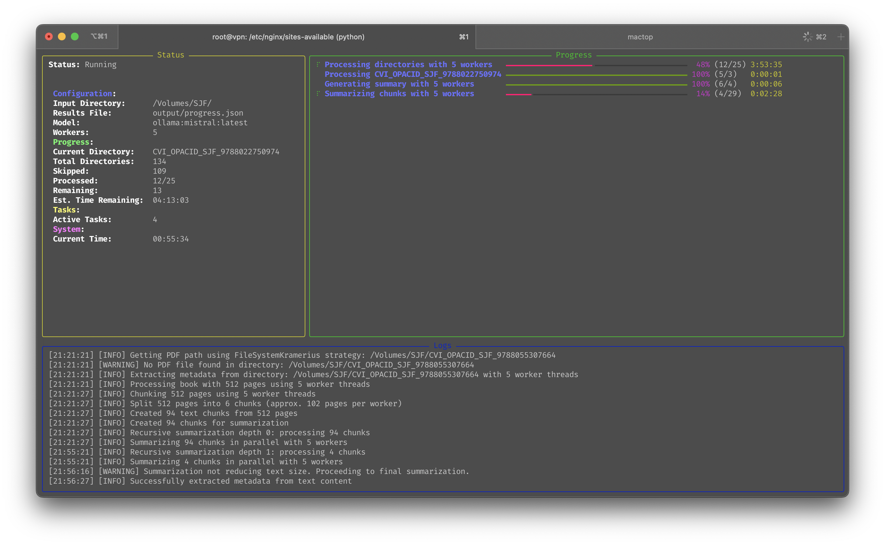
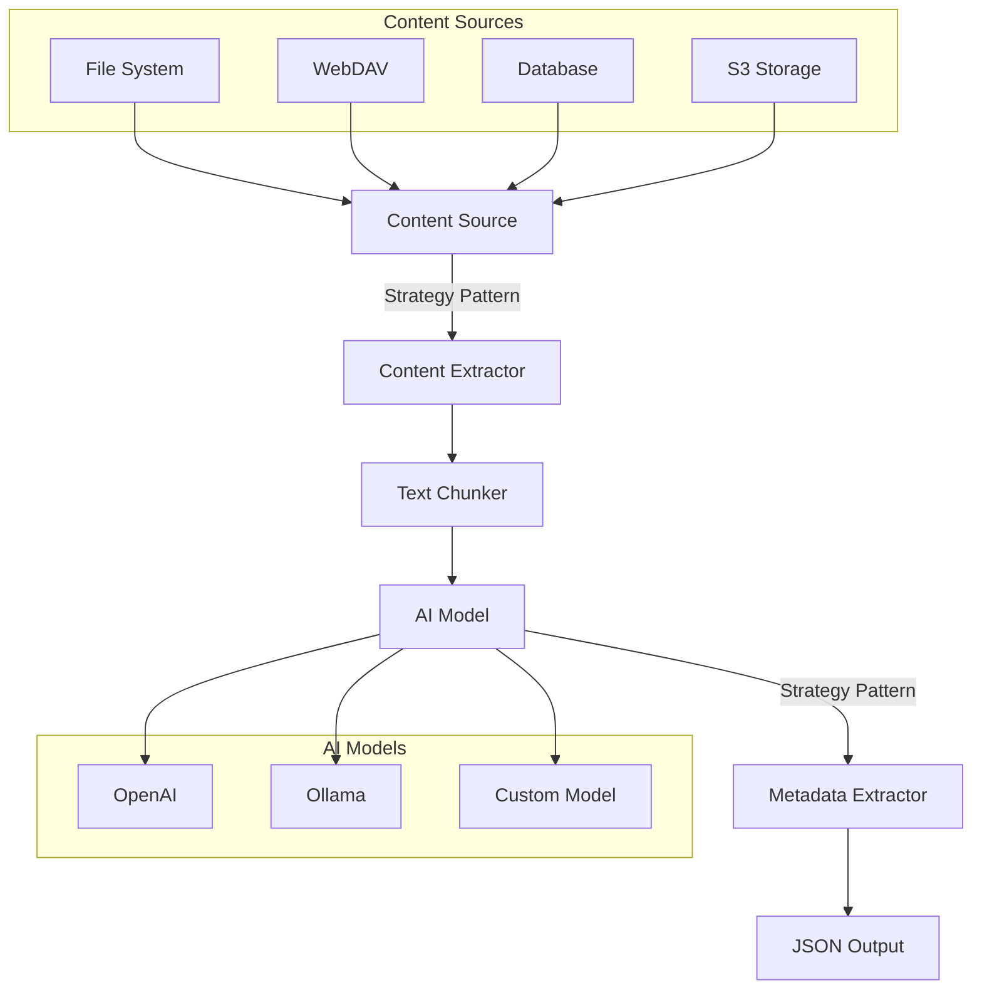
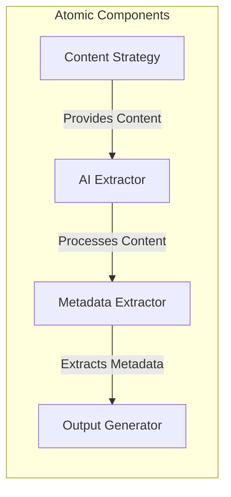
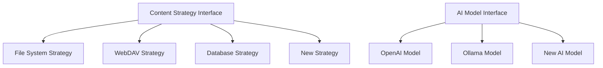

# EvilFlowers Importer

A tool for importing data from various sources through an AI extraction pipeline to JSON files for the 
EvilFlowers OPDS catalog.



## Overview

EvilFlowers Importer is a specialized tool designed to extract structured metadata from unstructured content sources 
using AI. It processes content from various sources, extracts metadata using AI models, and generates standardized
JSON output files that can be imported into the EvilFlowers OPDS catalog.

## Key Features

- **Flexible Data Sources**: Import from file systems, WebDAV servers, and more through the strategy pattern
- **AI-Powered Extraction**: Extract metadata using OpenAI or local Ollama models
- **Extensible Architecture**: Easily add new data sources or AI models
- **Parallel Processing**: Process multiple items simultaneously for improved performance
- **Progress Tracking**: Resume interrupted operations from where you left off
- **Modern TUI**: Real-time feedback with progress bars and logging

## Architecture

The EvilFlowers Importer is built with modularity and extensibility in mind, using design patterns to ensure clean 
separation of concerns.

### System Architecture



### Atomicity

Each component in the pipeline operates independently and can be replaced or modified without affecting other components:



### Extensibility

The system is designed to be easily extended with new components:



## Installation

```bash
# Clone the repository
git clone https://github.com/evilflowers/evilflowers-importer.git
cd evilflowers-importer

# Install dependencies
pip install -r requirements.txt
```

## Usage

### Basic Usage

```bash
python -m evilflowers_importer \
  --input-dir INPUT_DIRECTORY \
  --results-file OUTPUT_FILE.json
```

### Advanced Usage

```bash
python -m evilflowers_importer \
  --input-dir INPUT_DIRECTORY \
  --results-file OUTPUT_FILE.json \
  --model-type openai \
  --model-name gpt-4o \
  --strategy kramerius \
  --workers 4 \
  --verbose
```

### Command-Line Arguments

| Argument | Description | Default |
|----------|-------------|---------|
| `--input-dir` | Path to the input directory or connection string | Required |
| `--results-file` | Path to the output JSON file | Required |
| `--api-key` | API key for AI model (can also use OPENAI_API_KEY env var) | None |
| `--model-type` | Type of AI model to use (openai, ollama) | openai |
| `--model-name` | Name of the model to use | gpt-4o (OpenAI), mistral (Ollama) |
| `--strategy` | Import strategy to use (kramerius, dummy) | kramerius |
| `--workers` | Number of worker threads for parallel processing | CPU count |
| `--limit` | Limit the number of items to process | None |
| `--ignore-progress` | Ignore existing progress | False |
| `--verbose` | Enable verbose logging | False |

## Output Format

The tool generates a JSON file with the following structure for each processed item:

```json
{
  "dirname": "path/to/item",
  "title": "Item Title",
  "authors": ["Author 1", "Author 2"],
  "publisher": "Publisher Name",
  "year": "2023",
  "isbn": "978-3-16-148410-0",
  "doi": "10.1000/xyz123",
  "summary": "A brief summary of the item content...",
  "cover_image": "path/to/cover.jpg"
}
```

## Extending the Importer

### Adding a New Content Source

1. Create a new class that inherits from `ContentStrategy`
2. Implement the required methods:
   - `list_items`: List all items to process
   - `process_item`: Process a single item
   - `get_text_content`: Get text content from the item
   - `get_cover_image_path`: Get the cover image path
   - `get_pdf_path`: Get the PDF path
3. Register your strategy in the `StrategyFactory`

Example:

```python
class S3Strategy(ContentStrategy):
    def list_items(self, client, base_dir: str):
        # List objects in S3 bucket
        return [obj for obj in client.list_objects(base_dir)]

    def process_item(self, client, item: str, progress_bar=None):
        # Process S3 object
        text_content = self.get_text_content(client, item, progress_bar)
        cover_path = self.get_cover_image_path(client, item)
        pdf_path = self.get_pdf_path(client, item)

        return {
            'text_content': text_content,
            'cover_path': cover_path,
            'pdf_path': pdf_path
        }

    # Implement other required methods...
```

### Adding a New AI Model

1. Create a new class that inherits from `AIModelInterface`
2. Implement the required methods:
   - `generate_text`: Generate text from a prompt
   - `count_tokens`: Count tokens in a text
3. Register your model in the `AIModelFactory`

Example:

```python
class HuggingFaceModel(AIModelInterface):
    def __init__(self, model_name="gpt2"):
        # Initialize the model
        self.model = AutoModelForCausalLM.from_pretrained(model_name)
        self.tokenizer = AutoTokenizer.from_pretrained(model_name)

    def generate_text(self, prompt: str, temperature: float = 0.1):
        # Generate text using the model
        inputs = self.tokenizer(prompt, return_tensors="pt")
        outputs = self.model.generate(
            inputs.input_ids,
            max_length=1024,
            temperature=temperature
        )
        return self.tokenizer.decode(outputs[0])

    def count_tokens(self, text: str):
        # Count tokens in the text
        return len(self.tokenizer.encode(text))
```

## Using Local Models with Ollama

For privacy or cost reasons, you may want to use local AI models instead of cloud-based ones. EvilFlowers Importer 
supports [Ollama](https://ollama.ai/) for running local models.

### Setup

1. Install Ollama from [ollama.ai](https://ollama.ai/)
2. Pull the Mistral model:
   ```bash
   ollama pull mistral
   ```

### Running with Ollama

```bash
python -m evilflowers_importer \
  --input-dir INPUT_DIRECTORY \
  --results-file OUTPUT_FILE.json \
  --model-type ollama \
  --model-name mistral
```

## Examples

### Processing a Directory of Books

```bash
# Process a directory of books using OpenAI
export OPENAI_API_KEY="your-api-key"
python -m evilflowers_importer \
  --input-dir "/path/to/books" \
  --results-file "output/books.json" \
  --verbose

# Process using local Ollama model
python -m evilflowers_importer \
  --input-dir "/path/to/books" \
  --results-file "output/books.json" \
  --model-type ollama \
  --model-name mistral
```

### Processing a Specific Format

```bash
# Process Kramerius format
python -m evilflowers_importer \
  --input-dir "/path/to/kramerius/books" \
  --results-file "output/kramerius_books.json" \
  --strategy kramerius
```

## Troubleshooting

- **API Key Issues**: Ensure your OpenAI API key is valid and has sufficient credits
- **Performance Issues**: Adjust the number of workers with `--workers` to match your system capabilities
- **Memory Issues**: Process fewer items at once using the `--limit` option
- **Incomplete Results**: Use the progress tracking feature to resume interrupted operations

## Contributing

Contributions are welcome! Please feel free to submit a Pull Request.

1. Fork the repository
2. Create your feature branch (`git checkout -b feature/amazing-feature`)
3. Commit your changes (`git commit -m 'Add some amazing feature'`)
4. Push to the branch (`git push origin feature/amazing-feature`)
5. Open a Pull Request

## Acknowledgment

This open-source project is maintained by students and PhD candidates of the
[Faculty of Informatics and Information Technologies](https://www.fiit.stuba.sk/) at the Slovak University of
Technology. The software is utilized by the university, aligning with its educational and research activities. We
appreciate the faculty's support of our work and their contribution to the open-source community.


